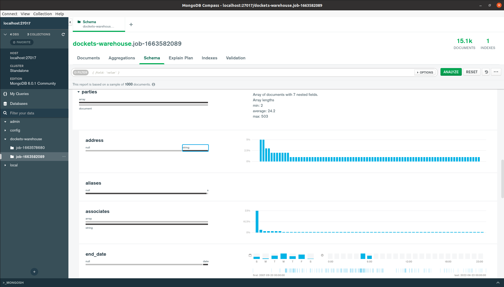

# Docket Scraper

Spiders Implemented

- https://courtconnect.courts.delaware.gov/cc/cconnect/ck_public_qry_main.cp_main_idx

More spiders related to case dockets can be added in this project

## Tech Stack

1. python 3.10
1. scrapy 2.6.2
1. redis 7.0.4
1. mongod 6.0.1

## How To Setup

#### Pre-requisites

You need to install:

1. [Docker](https://docs.docker.com/engine/install/)
    1. Tested with Docker version `20.10.18, build b40c2f6`
1. [Docker Compose](https://docs.docker.com/compose/install/)
    1. Tested with docker-compose version `1.25.0`
1. [MongoDB Compass](https://www.mongodb.com/try/download/compass)
    1. To preview the data extracted and stored in mongodb

#### Run Distributed Crawler

1. `sudo docker-compose build --no-cache`

1. `sudo CRAWLING_JOB_ID=$(date +%s) docker-compose scale redis=1 mongo_db=1 url_scheduler=1 crawler=4`
    - The above command will spawn the following services:
        1. `redis`
            - To keep track of the crawler start urls and to avoid duplicate request
        1. `mongodb`
            - To store the parsed case dockets in the database
            -
        1. `url_scheduler`
            - To provide starting point to the distributed crawlers to start crawling
            - Running this service will `flush the previously scheduled urls in the redis service`
        1. `crawler`
            - To crawl and parse case dockets from the `court connect` website
            - we are spawning `4 distributed crawlers`
            - The number of crawler can be scaled as per need and requirements

1. To preview scraped data, open MongoDB compass
    - Connect with MongoDB using MongoDB URI `mongodb://{mongo-db-container-ip}:{port}`
    - In my case MongoDB URI was `mongodb://localhost:27017`
    - Click Databases
    - Click `dockets-warehouse` database
    - Click the last created collection
        1. The command to run the project is designed in such a way that, for each new crawl a new collection of
           documents is created in the database
        1. A collection's name follows the following format
            - `job-{crawling-job-id}`
            - the command to run the spiders accepts `CRAWLING_JOB_ID`, at the moment we are passing timestamp in it
            - a new collection in the `dockets-warehouse` database may be named as `job-1663582089`

#### Stop Distributed Crawler

1. `sudo docker-compose stop`
    - To stop all the docket services
1. `sudo docker-compose crawler`
    - To stop only crawler services
    - Stopping the crawlers only will persist the queues requests and on resuming the crawlers will use these queued
      requests from redis

## Architecture & Design

#### Application Architecture


#### Crawler Architecture

A spider is divided into 4 components

- `BaseParseSpider`
    - An interface to make sure every spider added follows same conventions overall the project
- `BaseCrawlSpider`
    - Wraps all the spider/website independent crawling logic
    - attaches crawling related fields with a spider
    - all crawl spiders should inherit from BaseCrawlSpider
- `Parse Spider`
    - Implements website specific item parsing logic and cleaning rules
- `Crawl Spider`
    - Implements website specific crawling logic and cleaning rules


#### Pipelines
1. Drop Duplicate Items -> Logic implemented in BaseCrawlSpider
1. Attach Crawl Identification Fields
1. MongoDB Pipeline

## Bypass Bot Detection

1. To avoid blocking a `rotating random user agent middleware` is in place.
    - It selects a user agent from a pool of user agents and replaces the scrapy user agent
1. To prevent blocking by website cookies, Cookies are cleared in every request
1. It is observed that making requests more than 8 requests at the same for `courtconnect` website result
   in `status code 503` for some responses.
    - Added a Download Delay of 0.5 seconds to avoid this
    - Retrying the request with status code 503, resolves this issue

## Item Schema

```
{
   "url": string,
   "id": string,
   
   "start_date": string | null, // Not enough data to accurately convert into date object
   "end_date": string | null, // Not enough data to accurately convert into date object
   
   "title": string,
   "filing_date": date,
   "type": string,
   "status": string,
   "parties": [
      {
         "associates": string[],
         "end_date": date | null,
         "type": string,
         "id": string,
         "name": string,
         "address": string | null,
         "aliases": string | null
      }
   ],
   "entries": [
      {
         "filing_date": date | null,
         "description": string,
         "party": string | null,
         "monetary": string | null,
         "content": string | null 
      }
   ],
   "crawling_job_id": timestamp,
   "crawler_id": uuid,
   "spider_name": string,
   "crawled_at": date 
}
```

## How Data Looks in MongoDB Compass

#### Data Query View


#### Data Sampling Preview




## Decisions Made in Designing The Application

1. Why I chose the site `https://courtconnect.courts.delaware.gov`, labeled with difficulty level Medium?
    - Out of three websites provided to extract data, only `courtconnect` is accessible in `Pakistan`.
    - Free proxies were not helpful to open sites and were taking forever to load the websites.
    - If I were to write the crawler, for the easy or the hard difficulty level, I have to pay for some premium proxy
      which are expensive. That narrowed down my choices and I ended up writing spider for `courtconnect` site.

1. Why I went after distributed crawling instead of centralized crawling?
    - I observed the site takes too much time to return the response against a request.
    - Too much wait time for I/O means we are not utilizing the computations power to process extracted items.
    - To speed up item processing through pipelines, I opted for distributed crawling.

1. Why I chose noSQL database to store items.
    - NoSQL databases offer flexibility for an item schema. They don't force us to insert an item with fixed number of
      fields.
    - In addition to that the data we are extracting is transactional.
        - Transactional data means it's state will be changed over time. We will have to fetch/scrape data again to
          update our system.
        - To preserve the data state of the data at the time of extraction we have to create a data warehouse. NoSQL databases are good choice for it
    - In cases where we have to store copies of data from disparate sources to facilitate Data Analysis, Data Mining
      noSQL is a good choice.
      
1. Why I chose MongoDB?
    - The data we are dealing with Document like structure. 
    - MongoDB is a NoSQL Document Database. It's suitable for our task.
    - In addition to that they have provided `MongoDB Compass` to explore and analyze the data. Due to MongoDB Compass support I opted MongoDB over other Document Databases.
    
## Bonus
1. Implemented distributed crawling using `scrapy-redis`
1. Integrated `MongoDB Compass` -> A database visualization and query tool

## Case Dockets JSON Data
- An output file is placed with name `court-connect.json`
- This data is exported from MongoDB in JSON format.
- Importing this data in MongoDB works fine.
- Here is the link to import data in MongoDB: https://www.mongodb.com/docs/compass/current/import-export/

## NOTE: 
- The shared contains around 23K cases and is collected after 5 hour crawling time.
- It's not a complete crawl run of the website. According to my estimation there may be 500K cases.
- The complete crawl may take upto 3 days. It's not feasible for me to run the crawler on my personal machine.
